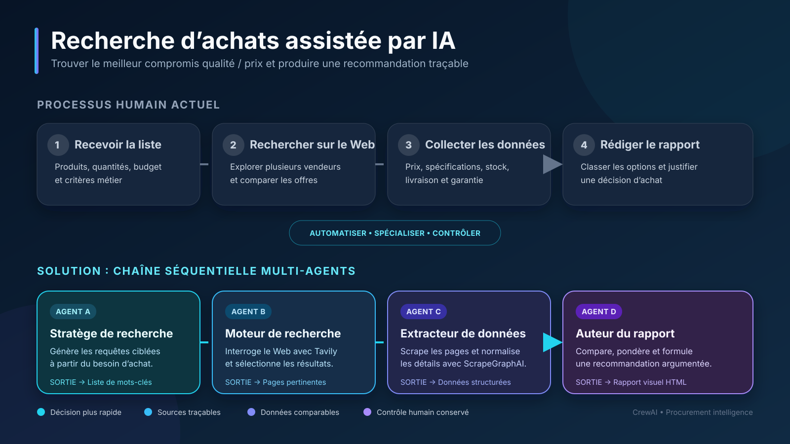
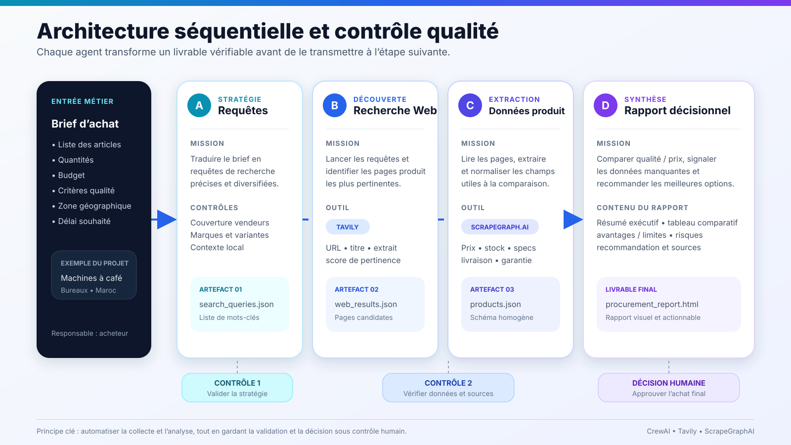
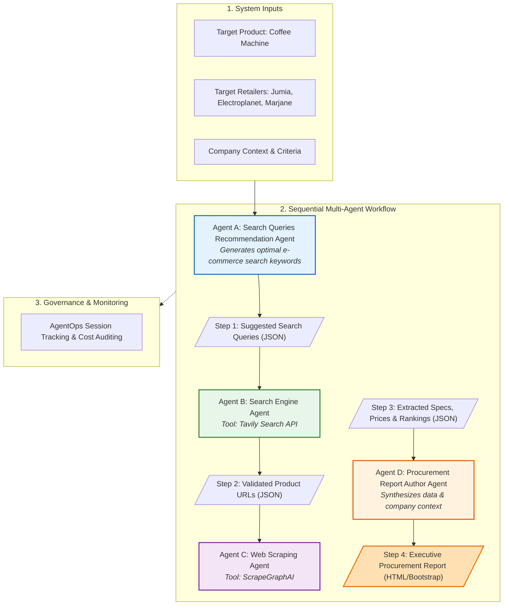

# AI Agents with CrewAI: Automated Procurement & Market Research

[](https://www.python.org/)
[](https://github.com/crewAIInc/crewAI)
[](https://aistudio.google.com/)
[](https://tavily.com/)
[](https://scrapegraphai.com/)
[](https://agentops.ai/)
[](LICENSE)

An end-to-end multi-agent system built with [CrewAI](https://github.com/crewAIInc/crewAI) that automates product market research, web scraping, price comparison, and executive procurement report generation.

---

##  Use Case & Problem Statement

### The Scenario
A procurement employee or purchasing manager is tasked with finding the best quality-to-price products (e.g., office coffee machines) across multiple e-commerce websites and producing a comprehensive report to support executive purchasing decisions.

### The Traditional Human Workflow
```
[Product Requirements] ──> [Manual Web Search] ──> [Visit E-Commerce Links] ──> [Extract Prices & Specs] ──> [Draft Comparison & Report]
```
1. **Query Formulation**: Manually brainstorm search terms for different retailers.
2. **Web Searching**: Browse through pages of search results, sifting through irrelevant blogs, ads, and category listings.
3. **Data Collection & Extraction**: Open numerous product tabs, copy prices, discounts, specifications, and warranty details into spreadsheets.
4. **Analysis & Decision Report**: Manually calculate cost differences, rank recommendations, and draft a procurement report for stakeholders.

**Pain points**: Time-consuming, error-prone, inconsistent formatting, and unscalable when analyzing dozens of products across multiple marketplaces.



---

## 💡 The Multi-Agent Solution

Rather than relying on a single prompt or monolithic LLM, this project implements a **Sequential Multi-Agent Architecture** adhering to the *Separation of Concerns* principle. 

Each discrete stage is delegated to a dedicated AI agent with strict schemas (via Pydantic), specialized tools, and precise quality controls:



### Pipeline Flowchart



---

##  Detailed Agent Breakdown

| Agent | Role & Objective | Tools / Tech | Output Artifact |
|---|---|---|---|
| **Agent A: Search Queries Recommendation Agent** | Analyzes the product requirements and target storefronts to generate diverse, high-intent e-commerce search queries. | Google Gemini, Pydantic validation | `ai-agents-output/step_1_Suggested_Search_Queries.json` |
| **Agent B: Search Engine Agent** | Executes web searches based on Agent A's queries, filters out blog posts/aggregators, and retains single-product store links meeting confidence thresholds. | Tavily Search Client (`tavily-python`) | `ai-agents-output/step_2_search results.json` |
| **Agent C: Web Scraping Agent** | Navigates to individual product pages to extract structured product information (current price, original price, discount, key specs, and rank). | ScrapeGraphAI (`scrapegraph-py`), Pydantic | `ai-agents-output/step_3_search_results.json` |
| **Agent D: Procurement Report Author Agent** | Combines company purchasing requirements, product rankings, and scraped specifications into a formatted, executive-ready HTML procurement dossier. | Google Gemini, Bootstrap 5 UI Framework, Company Knowledge Source | `ai-agents-output/step_4_procuremnt_report.html` |

---

##  Project Structure

```
Ai_agents_with_Crewai/
├── ai_agents.ipynb                # Main Jupyter Notebook containing agent definitions & pipeline execution
├── ai-agents-output/              # Step-by-step intermediate and final artifacts
│   ├── step_1_Suggested_Search_Queries.json   # Generated search queries
│   ├── step_2_search results.json             # Single-product URLs from Tavily search
│   ├── step_3_search_results.json             # Deep-scraped product specs & rankings
│   └── step_4_procuremnt_report.html          # Interactive HTML/Bootstrap procurement report
├── requirements.txt               # Project dependencies
├── .env.example                   # Template for environment variables and API keys
├── .env                           # Secret API keys (not committed)
└── agentops.log                   # Local session logs from AgentOps observability
```

---

##  Prerequisites & Installation

### Requirements
- **Python**: `3.10`, `3.11`, or `3.12` *(Note: CrewAI 0.95.0 is incompatible with Python 3.13+)*
- API Keys:
  - [Google Gemini API Key](https://aistudio.google.com/) (LLM and embedding services)
  - [Tavily Search API Key](https://tavily.com/) (Web searching)
  - [ScrapeGraphAI API Key](https://scrapegraphai.com/) (AI-powered web scraping)
  - [AgentOps API Key](https://agentops.ai/) (Session observability and tracing)

### Step-by-Step Setup

**1. Clone the repository**
```bash
git clone https://github.com/HamouniAhmed/AiAgent_With_Crewai.git
cd Ai_agents_with_Crewai
```

**2. Create and activate a virtual environment**
```bash
# On Windows
python -m venv venv
venv\Scripts\activate

# On macOS/Linux
python3 -m venv venv
source venv/bin/activate
```

**3. Install dependencies**
```bash
pip install -r requirements.txt
```

**4. Configure environment variables**

Create a `.env` file in the root directory:
```ini
# AgentOps - https://agentops.ai
AGENTOPS_API_KEY="your_agentops_key"

# Google Gemini - https://aistudio.google.com/apikey
GEMINI_API_KEY="your_gemini_key"

# Tavily Search - https://tavily.com
tavily_api="your_tavily_key"

# ScrapeGraphAI - https://scrapegraphai.com
scrapegraph_api="your_scrapegraph_key"
```

**5. Launch and Run**
```bash
jupyter notebook ai_agents.ipynb
```
Run the notebook cells sequentially. The crew will kickoff the workflow, query the web, extract product details, and produce the final procurement report in `ai-agents-output/step_4_procuremnt_report.html`.

---

##  Key Dependencies

| Package | Version | Purpose |
|---|---|---|
| `crewai[tools]` | `>=0.95.0` | Autonomous multi-agent orchestration framework |
| `google-genai` | Latest | Google Gemini SDK for LLM reasoning and text embeddings |
| `tavily-python` | Latest | Search engine API optimized for autonomous agents |
| `scrapegraph-py` | Latest | LLM-driven web scraping pipeline for structured data extraction |
| `pydantic` | Latest | Strict schema enforcement and output serialization |
| `agentops` | Latest | Multi-agent session telemetry, tool call tracking, and latency profiling |
| `python-dotenv` | Latest | Secure environment variable configuration |

---

##  Observability & Quality Assurance

This system integrates with **AgentOps** for full visibility across the agent lifecycle:
- **Execution Tracking**: Monitor task completion latency and failure rates.
- **Tool Tracing**: Inspect raw Tavily search queries and ScrapeGraphAI extraction schemas.
- **Token & Cost Auditing**: Monitor LLM token consumption across all 4 agents.
- **Audit Logs**: Stored locally in `agentops.log` and accessible via the AgentOps dashboard.

---

## 📄 License

This project is licensed under the MIT License.
