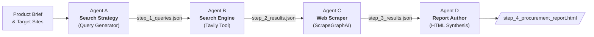

# AI Agents with CrewAI: Automated Procurement & Market Research

[](https://www.python.org/)
[](https://github.com/crewAIInc/crewAI)
[](https://aistudio.google.com/)
[](https://tavily.com/)
[](https://scrapegraphai.com/)
[](https://agentops.ai/)
[](LICENSE)

A sequential multi-agent system built with [CrewAI](https://github.com/crewAIInc/crewAI) to automate product research, price comparison, web scraping, and decision-ready procurement reporting.

---

## Use Case

A company needs to find the best quality/price products (e.g., office coffee machines) across e-commerce sites and generate a report to support purchasing decisions.

- **Human Workflow**: List items ➔ Search web ➔ Collect prices & specs ➔ Write decision report.
- **Agent Solution**: A sequential 4-agent pipeline where each task has a dedicated agent with strict schema validation.

---

## Sequential Flow



---

## Agents Overview

| Agent | Task | Tool | Output |
|---|---|---|---|
| **Agent A: Search Queries** | Generate targeted e-commerce search keywords | Gemini LLM | `step_1_Suggested_Search_Queries.json` |
| **Agent B: Search Engine** | Search the web for single-product pages | Tavily API | `step_2_search results.json` |
| **Agent C: Scraping Agent** | Extract prices, specs, discounts, and ranks | ScrapeGraphAI | `step_3_search_results.json` |
| **Agent D: Report Author** | Synthesize data into a Bootstrap procurement report | Gemini LLM | `step_4_procuremnt_report.html` |

---

## Project Structure

```
Ai_agents_with_Crewai/
├── ai_agents.ipynb                # Main notebook with agents & pipeline
├── ai-agents-output/              # Step-by-step pipeline outputs
│   ├── step_1_Suggested_Search_Queries.json
│   ├── step_2_search results.json
│   ├── step_3_search_results.json
│   └── step_4_procuremnt_report.html
├── requirements.txt               # Dependencies
├── .env.example                   # API keys template
└── agentops.log                   # AgentOps monitoring logs
```

---

## Quick Start

**1. Clone & install**
```bash
git clone https://github.com/HamouniAhmed/AiAgent_With_Crewai.git
cd Ai_agents_with_Crewai
python -m venv venv
# Windows: venv\Scripts\activate | Unix: source venv/bin/activate
pip install -r requirements.txt
```

**2. Configure `.env`**
```ini
AGENTOPS_API_KEY="your_agentops_key"
GEMINI_API_KEY="your_gemini_key"
tavily_api="your_tavily_key"
scrapegraph_api="your_scrapegraph_key"
```

**3. Run the notebook**
```bash
jupyter notebook ai_agents.ipynb
```

---

## License

MIT License.
